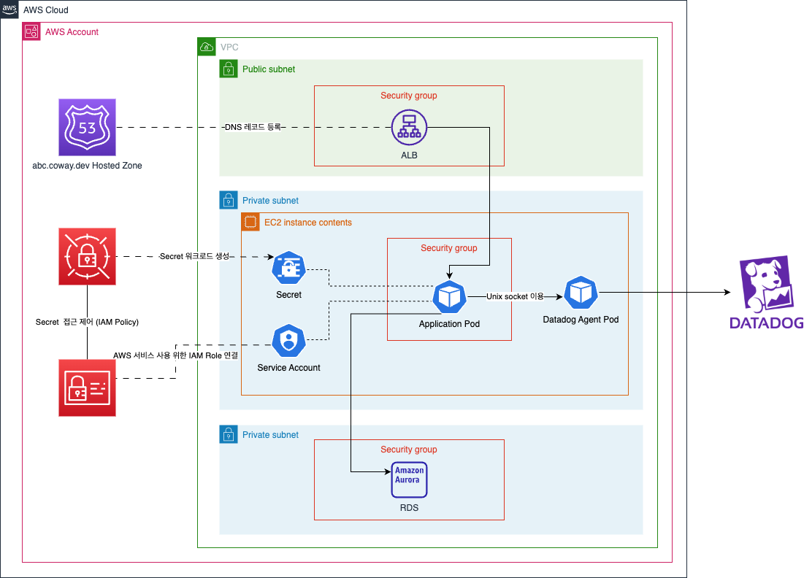

# Example

"미신사" 프로젝트에서 CI/CD 적용 등을 참고하기 위한 Spring Application 예제 입니다.

## 아키텍쳐



## 인증 및 권한

사용자 인증 정보는 IAM 을 이용하였으며, 인증 및 권한 관리 서비스는 Coway SDK 를 이용하였습니다.

### 사용자 Access Token 발급

[nextjs example](https://example-nextjs.abc.coway.dev/) 에 접속하여 IAM 인증시 사용하는 로그인 정보를 입력하면 해당 프로젝트에서 사용할 수 있는 Access Token 을 발급 받을 수 있습니다. 

### Access Token 검증

Request 의 Authorization Header 로 서버에 전달된 Access Token 은
[Spring Security OAuth 2.0 Resource Server](https://docs.spring.io/spring-security/reference/servlet/oauth2/resource-server/index.html) 에서
[Coway SDK 인증 서버에서 제공하는 JWK(JSON Web Key)](https://api.cw-sdk.coway.do/oauth2/jwks) 를 이용하여 위변조 여부를 검증 하여
유효한 Access Token 일 경우 인증 완료된 상태로 처리 됩니다.

### 권한

Coway SDK 에 아래와 같은 권한 규칙이 저장되어 있으며, IAM 조직도에서 `IT개발실` 또는 하위 팀 소속 인 경우에만 권한이 허용되도록 설정되어 있습니다.

| RESOURCE_ID | ACTION_ID | ALLOW |
|-------------|-----------|------|
| COMMENT     | VIEW      | O    |
| COMMENT     | CREATE    | O    |
| COMMENT     | UPDATE    | X    |
| COMMENT     | DELETE    | O |

권한 확인은 `com.coway.america.example.security.AccessControlEvaluatorImpl.kt` 에서 처리되고 있으며,
아래 코드와 같이 권한 관리가 필요한 Controller 의 method 에 PreAuthorize 어노테이션으로 확인 절차를 진행 합니다.

```kotlin
@PreAuthorize("@accessControl.hasPermission('RESOURCE_ID', 'ACTION_ID')")
fun protectedResourceAction() { ... }
```

_! Coway SDK 사용을 위해서는 COWAY_SDK_API_KEY 환경변수를 주입해야 하며,
해당 정보는 [AWS Secrets Manager example.example.dev](https://us-west-2.console.aws.amazon.com/secretsmanager/secret?name=example.example.dev&region=us-west-2)
를 참고 해주세요._
